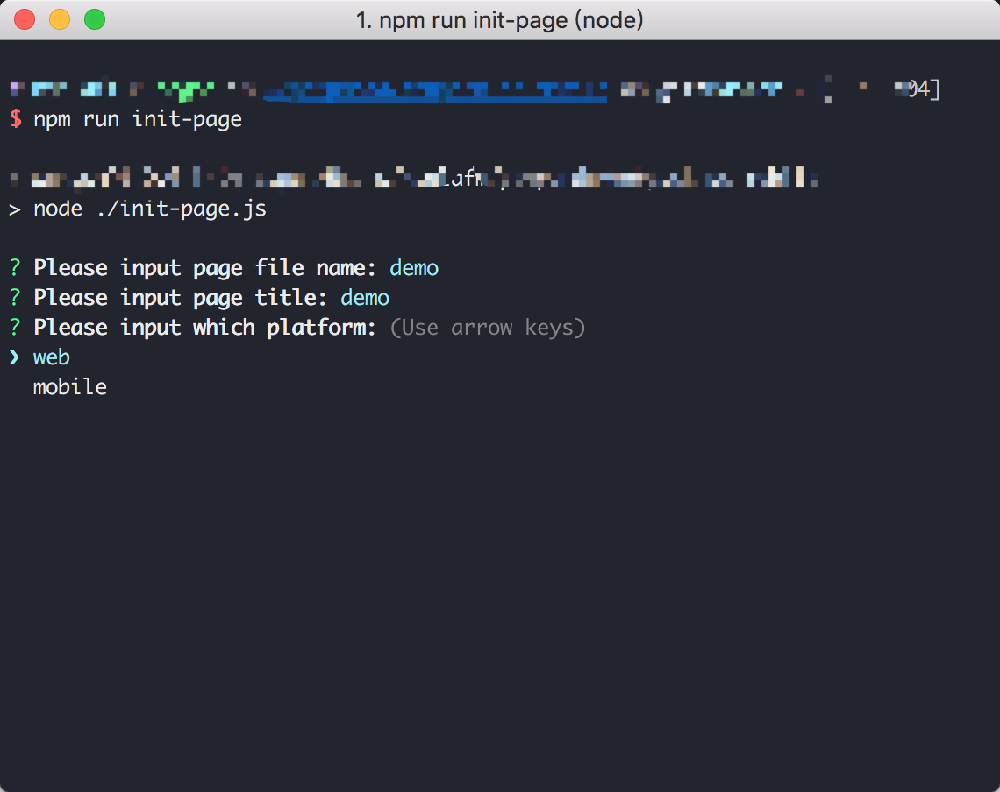
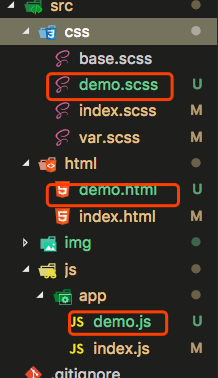
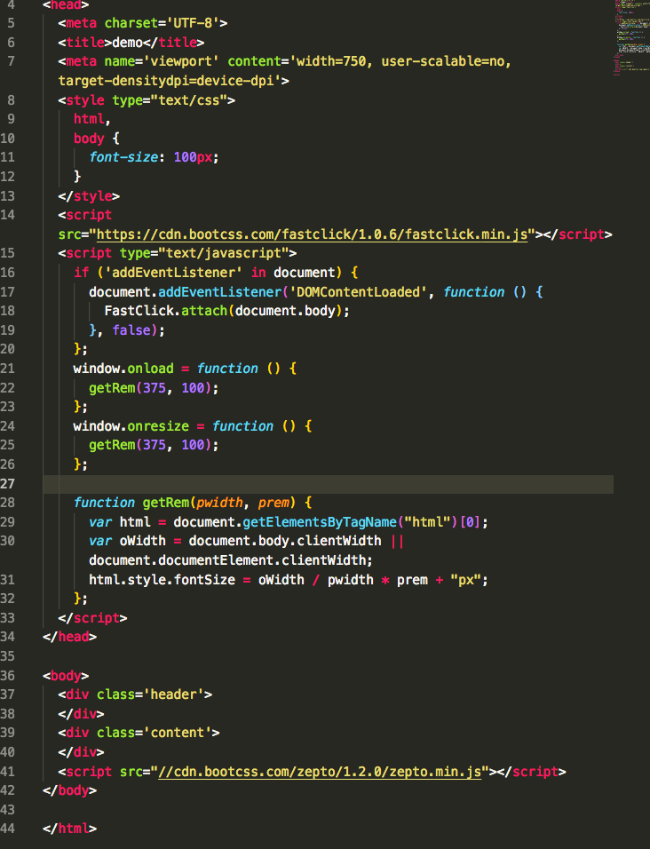

# webpack-pc-mobile

基于webpack的前端项目模板

## Script

1.  `init-page`: 初始化项目
  

  文件名称 --- title --- 选择平台

会自动生成文件目录

demo.html 生成的移动端项目模板

2. `dev:web`: local develop pc端
3. `dev:phone`: local develop m端
4. `build`: 打包编译

